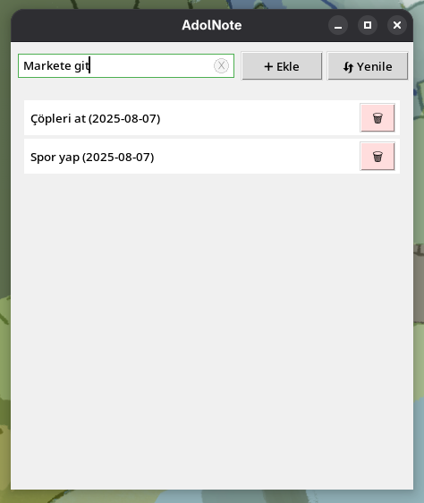

# 📓 AdolNote

AdolNote, Linux kullanıcıları için geliştirilen minimalist ve hızlı bir not alma uygulamasıdır. 
Hem terminal (CLI) hem de basit bir grafik arayüz (GUI) sunar. 
Python ile yazılmış açık kaynaklı bir projedir.

---
## 🖼️ Ekran Görüntüsü



---

## 🚀 Özellikler

- ✅ Not ekleme, silme, listeleme (CLI ve GUI)
- ✅ Kopyalama, anlık bildirim (GUI)
- ✅ Temiz ve sade arayüz
- ✅ Tkinter ile GUI desteği
- ✅ Python ile geliştirildi
- ✅ Açık kaynak (MIT lisanslı)

---

## 📦 Kurulum

### Gereksinimler

- Python 3.8+
- Tkinter (`sudo pacman -S tk` – Arch Linux için)

### Kurulum Adımları

```bash
# 1. Depoyu klonlayın
git clone https://github.com/Aybarssafak/AdolNote.git
cd AdolNote


- Debian/Ubuntu:
  sudo apt install python3-tk

- Fedora:
   sudo dnf install python3-tkinter

- Arch:
  sudo pacman -S tk

- MacOS:
  brew install python-tk

- Windows:
  Tkinter genellikle Python'a dahildir.
  Eksik ise, python.org'dan python'u yeniden yükleyin


```

---

## 🖥️ Kullanım

### 🔸 CLI (Terminal) Kullanımı

```bash
# Not ekle
python cli/main.py --add "Bugün çalışmalıyım"

# Notları listele
python cli/main.py --list

# Not sil (ID ile)
python cli/main.py --delete 1
```

### 🔹 GUI (Grafik Arayüz) Kullanımı

```bash
python gui/app.py
```

---

## 🗂️ Proje Yapısı

```bash
AdolNote/
├── cli/              # Komut satırı arayüzü
│   └── main.py
├── gui/              # Grafik arayüz
│   └── app.py
├── utils/            # Not kayıt/silme işlevleri
│   └── storage.py
├── requirements.txt  # Python bağımlılıkları
├── LICENSE           # MIT lisans dosyası
├── README.md         # Bu dosya
```

---

## 🧑‍💻 Geliştirici

**Aybarssafak**  
📍 Türkiye  
🌐 [GitHub](https://github.com/Aybarssafak)

---

## 📄 Lisans

Bu proje [MIT Lisansı](LICENSE) ile lisanslanmıştır.

---

## 🌟 Destek Ol

Projeyi beğendiyseniz ⭐ vererek destek olabilirsiniz.  
Arkadaşlarınızla paylaşmanız da motivasyon kaynağı olur 🙌

